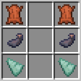

# Custom Recipes

***All recipes for custom items are crafted in droppers!***

Place the items in a **dropper** as indicated, not a crafting table, and **stand on top of the dropper** to complete the recipe. Doing things this way is necessary to create items with custom NBT data.

### Wading Boots

- Gives a small speed boost in water

### Flippers

- Gives a greater speed boost in water

### Tubing

- A crafting component for scuba gear

*This item is represented in further recipes by a rabbit's foot*

### Snorkel

- Allows the wearer to go a little longer without air

### Scuba Mask

- Allows the wearer to go a decent amount longer without air
- Allows the use of an oxygen tank

*This item is represented in further recipes by an enchanted chainmail helmet*

### Rebreather

- Allows the wearer to go much longer without air
- Allows the wearer to see clearly underwater
- Allows the use of an oxygen tank

### Oxygen Tank

- Allows breathing underwater for a short time when equipped

*This item is represented in further recipes by a diamond hoe*

### Advanced Oxygen Tank

- Allows breathing underwater for a longer time when equipped

### Speargun

- Consumes standard arrows
- Compatible with Multishot enchantment

# New recipes for existing items

Recipes for existing items use a crafting table.

### Sponge

